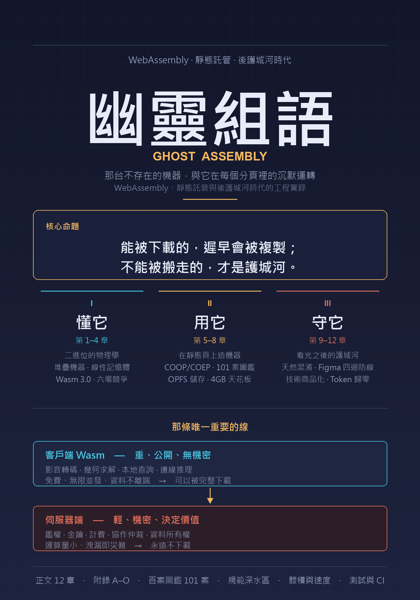

# 幽靈組語 · Ghost Assembly

<p align="center">
  
</p>

**🌐 Language / 語言 / 言語：[繁體中文](#繁體中文) · [English](#english) · [日本語](#日本語)**

---

<a id="繁體中文"></a>
## 繁體中文

> **那台不存在的機器，與它在每個分頁裡的沉默運轉。**
>
> 組合語言死過一次——它死於不可攜。而它回來了，只是換了一具身體：**這一次，它的機器不存在。正因為那台機器不存在，它才到處都在。**

二〇二六年夏天的某個下午三點四十分，一個很普通的問題被打進搜尋框：「請細說 WebAssembly 的發展史、優缺點、競品、著名的應用或是開源專案。」接下來的一個多小時裡，這條對話沒有停在入門處——它從「Wasm 是什麼」滑到「GitHub Pages 可以跑 server 嗎」，滾出一百二十個「別人在靜態頁上跑什麼」的案例，然後在一句追問前徹底轉向：

> **「在 GitHub Pages 跑程式，不是被看光了？」**
> **「Figma 若是 Wasm，不是也被看光了？」**
> **「那不用完整反編譯，只要下載後讓它在本地跑，Figma 不就無法以原本的商業模式進行？」**

這本書，就是那趟調查的紀錄。它從一台機器的物理定律開始，一路追問到那台機器被完整下載到全世界之後，價值到底留在了誰的手上。

> 💡 **全書的核心命題**
> **能被下載的，遲早會被複製；不能被搬走的，才是護城河。**
> Wasm 把運算變成了可以無限複製、零成本分發的東西——這既是它最大的禮物，也是它對商業模式最徹底的破壞。真正的架構功力，不在於把程式碼藏得多好，而在於清楚知道哪些東西本來就藏不住，然後把價值放到別的地方去。

### 三個樂章

| 樂章 | 動詞 | 內容 |
|------|------|------|
| **第一樂章（第 1–4 章）** | **懂它** | 從 NaCl 到 W3C 的前史、二進位格式與型別系統、線性記憶體與保護頁、分層編譯、跨界收費站、優缺點與三個維度的限制、與 JavaScript／Docker／V8 Isolates／EVM／WebGPU／原生的六場競爭 |
| **第二樂章（第 5–8 章）** | **用它** | GitHub Pages 跑 Wasm 的 COOP/COEP 那道坎與 `coi-serviceworker`、101 個案例的分類全景與五種通用架構、MEMFS/IDBFS/OPFS/WASI 四層儲存、4GB 天花板與四種破圈架構 |
| **第三樂章（第 9–12 章）** | **守它** | 二進位「天然混淆」的六個層次與兩大物理禁區、Figma 的四道防線與「本地私服」的失效、技術商品化與網絡效應的時間常數、Token 歸零後的時間陷阱與終局四層架構 |

懂它、用它、守它——這三個動詞彼此咬合：第一樂章那條 4GB 的線性記憶體上限，直接決定第二樂章的 FFmpeg.wasm 為什麼吃不下 4K 大檔；而第二樂章「把算力免費推給客戶端」的甜頭，正是第三樂章那道護城河**必須**建在別的地方的原因。

### 結構

- **正文 12 章**，每章採故事化情境拆解，附「💡 君之一席話」與「🔍 進階點評」。
- **附錄 A–O（15 份）**：A 大事年表與規範速查 · B 名詞與工具速查 · C GitHub Pages 部署實戰手冊 · **D–F 靜態頁 Wasm 百案圖鑑（101 案逐案深拆，三級真偽標記）** · G 儲存機制實作源碼參考（Rust + OPFS + Worker） · H 給 AI 編碼代理人的規格書範本 · I 限制與極限速查表 · J 前後端邊界決策表與護城河檢查清單 · K 爭議與真偽校準問答（26 問） · **L 深水案例：FluffOS × Wasm——把一整台 MUD 伺服器搬進靜態頁** · **M 規範深水區（二進位編碼、驗證演算法、`call_indirect`、例外處理 ABI、JSPI、原子操作、relaxed SIMD、多重記憶體、部署層、效能剖析、proxy-wasm、程式碼分割）** · **N 體積與速度（壓縮與加速全解：區段解剖、`wasm-opt` 內部、Rust 三大隱藏肥肉、壓縮字典傳輸、啟動四段、Wizer 預初始化、SIMD 現實、邊界減費、量測陷阱與兩張投報率總表）** · **O 測試、CI 與執行期安全（三層測試金字塔、`wasm-bindgen-test`、fuzzing、體積與金鑰的 CI 守門、跨引擎差異、執行期本身的攻擊面與供應鏈、可觀測性）**。

### 真偽紀律與紅線

本書橫跨可查證的規範事實與未經查證的社群說法：

- **所有效能數字均為引用值，未經獨立驗證。** 請以「**信其方向，疑其倍率**」閱讀。
- **本書以 WebAssembly 3.0（2025 年 9 月完成）為規範基準**。任何把 GC／memory64／尾呼叫／例外處理／多重記憶體稱為「提案」的資料，都寫於 3.0 之前。
- **百案圖鑑採三級真偽標記**：🟢 可查證（專案真實存在且有 Wasm 建置）· 🟡 上游真實但 Wasm 移植待考 · 🔴 示意性構造（技術路徑成立、專案查無此名）。**原始清單的 120 條中有 19 條是重複的，實際 101 條**——校準過程本身記錄在第 6 章。
- **規範層面的敘述**（二進位格式、提案狀態、瀏覽器 API 行為）**請以 WebAssembly 官方規範、MDN 與各引擎文件為最終依據**——這是一個提案還在移動的領域。
- 涉及二進位保護、逆向工程與程式碼混淆的內容，**均為架構決策的風險揭露，不構成規避他人授權、破解商業軟體或繞過技術保護措施的操作建議**。

### 怎麼讀 / 怎麼建置

照三樂章順序讀，或直接翻到你最關心的那一章。**如果你只有十分鐘**：讀第 9 章（都被看光了）與附錄 J（前後端邊界決策表）——那是全書最能直接動用的兩塊。**如果你想先看一個被拆到底的真實案例**：直接翻附錄 L（FluffOS × Wasm）。

建置為純 Python、無第三方依賴：

```bash
python _build.py        # 產出 幽靈組語.html（側欄目錄）＋ 幽靈組語_全書.md
python _convert_cn.py   # 繁體 → 简体（需 opencc；WSL 可 pip install opencc-python-reimplemented），輸出到 cn/
cd cn && python _build.py   # 再各自建置一次
python _make_cover.py   # 重新產生封面海報（需 Pillow）
```

#### PDF 生成注意事項（HTML → PDF）

PDF 一律由 `_build.py` 產出的 HTML 列印。**正解是 Chrome headless，不要手動 Ctrl+P。**

```bat
%CHROME% --headless=new --disable-gpu --run-all-compositor-stages-before-draw ^
  --virtual-time-budget=15000 --no-pdf-header-footer ^
  --user-data-dir="%TEMP%\udd_1" --print-to-pdf="out.pdf" "src.html"
ping -n 22 127.0.0.1 >nul
```

1. **用 headless，別手動 Ctrl+P。** 手動勾「背景圖形」會把 CSS 漸層逐頁點陣化 → 暴漲到 100 MB＋（最大的雷）。
2. **`--headless` 已被移除、變 no-op**，必須用 **`--headless=new`**，且**必加渲染等待旗標**，否則會印出空白。
3. **一次只印一個檔、每檔獨立 `--user-data-dir`**（用可寫目錄，別用 `C:\Windows\Temp`），印完清掉。
4. **中日文檔名先複製成 ASCII 暫存**再印，印完改回。
5. `.bat` 用 **CRLF + 純 ASCII 路徑**；從 WSL 經 `cmd.exe` 跑 bat 時 `timeout /t` 會失效，改用 `ping -n <秒+1> 127.0.0.1 >nul` 當 sleep。
6. **等夠久**：Chrome headless 是 async detach 寫檔，launch 後要等 ~30–40 秒才檢查產物。

> **本書實測**：繁體約 **18 MB**／简体約 **18 MB**（各約 **340 頁**）／English 約 **16 MB**（約 **414 頁**）／日本語約 **18 MB**（約 **400 頁**）——**含整頁封面海報的書落在這個量級是正常的**。若某一版明顯偏離比例（例如破 100 MB），多半是手動列印時勾了「背景圖形」把 CSS 漸層逐頁點陣化，或多版平行列印互相汙染——依上列規則重印即可。

### 語言版本

| 語言 | 狀態 | 位置 |
|------|------|------|
| 繁體中文 | ✅ 完成（12 章 + 附錄 A–O · HTML／合併 MD／PDF） | 倉庫根目錄 |
| 简体中文 | ✅ 完成（opencc `tw2sp` 轉換，含台灣用語→大陸用語） | [`cn/`](cn/) |
| English | ✅ 完成（全譯：12 章 + 附錄 A–O · HTML／合併 MD／PDF） | [`en/`](en/) |
| 日本語 | ✅ 完成（全訳：12 章 + 付録 A–O · HTML／合併 MD／PDF） | [`ja/`](ja/) |

---

<a id="english"></a>
## English

> **The machine that does not exist, and its silent execution in every tab.**
>
> Assembly died once — it died of not being portable. It came back wearing a different body: **this time, its machine does not exist. And precisely because that machine does not exist, it is everywhere.**

This book grew out of a single afternoon's investigation that started with "explain WebAssembly's history, pros and cons, competitors, and notable projects" and ended somewhere far more interesting: **if your `.wasm` is downloaded in full onto every stranger's computer, what exactly do you have left?**

> 💡 **The book's central thesis**
> **What can be downloaded will eventually be copied; what cannot be taken away is the moat.**
> Wasm turned computation into something infinitely copyable and free to distribute — which is both its greatest gift and its most complete demolition of a half-century-old assumption that code is an asset.

### Three movements

| Movement | Verb | Contents |
|----------|------|----------|
| **One (Ch. 1–4)** | **Understand it** | From NaCl to W3C · binary format, type system, structured control flow · linear memory & guard pages · tiered compilation · the boundary toll booth · limits across four dimensions · **six** simultaneous competitions (JS, Docker, V8 Isolates, EVM, WebGPU, native) |
| **Two (Ch. 5–8)** | **Use it** | The COOP/COEP wall on GitHub Pages and `coi-serviceworker` · a taxonomy of 101 real-world cases and the five architectures they all share · MEMFS/IDBFS/OPFS/WASI · the 4 GiB ceiling and four ways around it |
| **Three (Ch. 9–12)** | **Defend it** | Six levels of "natural obfuscation" and two absolute no-go zones · Figma's four lines of defence and why a local private server fails · the time constants of commoditization vs. network effects · the maintenance-entropy trap once tokens cost nothing |

### Structure

- **12 chapters**, each a story-driven scenario breakdown with "💡 A Word to the Wise" and "🔍 Deeper Commentary" boxes.
- **Appendices A–O (15)**, including the deep catalog **D–F: 101 static-page Wasm cases** (each tagged with a three-level authenticity marker) and **L: a single case study taken all the way down** — FluffOS compiled to Wasm, running an entire LPMud driver (compiler, VM, efuns, telnet) inside a browser tab, with the `fluffos/mudlibs` archive of 1990s Chinese MUD source shipped as static bundles; and **M: the spec deep end** — byte-level binary encoding, the polymorphic-stack validation trick, `call_indirect` and C++ vtables, the Wasm 3.0 exception ABI, JSPI, the atomics memory model, relaxed-SIMD nondeterminism, multiple memories, deployment (CSP/SRI/MIME), profiling, proxy-wasm, and code splitting; and **N: size and speed** — a full treatment of Wasm compression and acceleration, from section-level budgeting and what each `wasm-opt` pass actually does, to Rust's hidden `panic!` formatting bloat, Compression Dictionary Transport for delta updates, Wizer pre-initialization, the real ceiling on SIMD, boundary-cost reduction, and the timer-precision trap that makes most micro-benchmarks wrong; and **O: testing, CI and runtime security** — the three-tier test pyramid, `wasm-bindgen-test`, fuzzing, CI gates for size budget and secret leakage, cross-engine divergence, the three-layer attack surface that "Wasm is safe" conceals, and observability once you have stripped everything.

### Authenticity discipline

Verified specification facts and unverified community claims sit side by side. **Every performance figure is quoted, not independently measured — trust the direction, doubt the multiplier.** The 101-case catalog is tagged 🟢 verifiable / 🟡 upstream real, Wasm port unverified / 🔴 illustrative construction. **The original list of "120 cases" contained 19 duplicates; the calibration itself is documented in Chapter 6.** For anything at the specification level, defer to the official WebAssembly spec, MDN, and engine documentation.

Anything touching binary protection, reverse engineering, or obfuscation is **risk disclosure for architectural decisions only** — not operational advice for circumventing licences or technical protection measures.

### Read it

The complete English edition lives in [`en/`](en/):

| Format | File |
|--------|------|
| Online (sidebar TOC) | [`en/GhostAssembly.html`](en/GhostAssembly.html) |
| PDF (~16 MB, ~414 pages) | [`en/GhostAssembly.pdf`](en/GhostAssembly.pdf) |
| Merged Markdown | [`en/GhostAssembly_full.md`](en/GhostAssembly_full.md) |

### Build

Pure Python, no third-party deps: `python _build.py` produces a merged `.md` plus a sidebar-TOC `.html`; PDFs are printed from the HTML with **Chrome headless (`--headless=new` plus render-wait flags), never manual Ctrl+P**.

---

<a id="日本語"></a>
## 日本語

> **存在しない機械と、あらゆるタブでの沈黙の実行。**
>
> アセンブリは一度死んだ——可搬でなかったために死んだ。それは別の体をまとって戻ってきた。**今度は、その機械が存在しない。そして機械が存在しないからこそ、それはどこにでもある。**

本書は「WebAssembly の歴史、長所と短所、競合、注目すべきプロジェクトを説明せよ」から始まった、ある午後の調べ物から育った。そして、はるかに面白い場所へ行き着いた——**あなたの `.wasm` が、見知らぬ人すべての計算機へ丸ごとダウンロードされるのなら、あなたの手には結局、何が残るのか？**

> 💡 **本書の中核の命題**
> **ダウンロードできるものは、いずれ複製される。持ち去れないものが、堀である。**
> Wasm は計算を、無限に複製でき、配るのが無料のものへ変えた——それはこの技術の最大の贈り物であると同時に、「コードは資産である」という半世紀ぶんの前提への、最も徹底した取り壊しでもある。

### 三つの楽章

| 楽章 | 動詞 | 中身 |
|------|------|------|
| **第一部（第 1〜4 章）** | **理解する** | NaCl から W3C へ · バイナリ形式、型の体系、構造化された制御の流れ · 線形メモリとガードページ · 段階的なコンパイル · 境界という料金所 · 四つの次元の限界 · **六つ**の同時進行の競争（JS、Docker、V8 Isolates、EVM、WebGPU、native） |
| **第二部（第 5〜8 章）** | **使う** | GitHub Pages における COOP/COEP の壁と `coi-serviceworker` · 101 の実例の分類と、それらが共有する五つのアーキテクチャ · MEMFS/IDBFS/OPFS/WASI · 4 GiB の天井と、それを回る四つの道 |
| **第三部（第 9〜12 章）** | **守る** | 「天然の難読化」の六つの層と、二つの絶対的な禁域 · Figma の四つの防衛線と、なぜローカルの私設サーバが成り立たないのか · コモディティ化とネットワーク効果の時定数 · token が無料になったあとの、保守のエントロピーの罠 |

### 構成

- **12 章**。各章は物語で進むシナリオの分解であり、「💡 座右の一言」と「🔍 踏み込んだ論評」の囲みを備える。
- **付録 A〜O（15 本）**。うち **D〜F は静的ページ上の Wasm の 101 事例**の詳細な図鑑（各事例に三段階の真偽の印を付す）、**L は一つの事例を底まで掘り下げたもの**——FluffOS を Wasm へコンパイルし、LPMud のドライバ一式（コンパイラ、仮想機械、efun、telnet）をブラウザのタブの中で走らせ、一九九〇年代の中国語圏の MUD のソースを収めた `fluffos/mudlibs` の典蔵を静的な bundle として配る——、**M は仕様の深水域**（バイト単位のバイナリの符号化、多相スタックによる検証の技、`call_indirect` と C++ の vtable、Wasm 3.0 の例外の ABI、JSPI、原子操作のメモリモデル、relaxed SIMD の非決定性、複数メモリ、配備（CSP/SRI/MIME）、プロファイル、proxy-wasm、コードの分割）、**N は体積と速度**（セクション単位の予算づけと `wasm-opt` の各 pass が実際に何をするか、Rust の隠れた `panic!` の整形の膨らみ、差分更新のための圧縮辞書転送、Wizer の事前初期化、SIMD の本当の天井、境界の費用の削減、大半のマイクロベンチマークを誤らせるタイマの精度の罠）、**O はテスト・CI・実行時のセキュリティ**（三層のテストの角錐、`wasm-bindgen-test`、fuzzing、体積の予算と鍵の漏れを守る CI の門番、エンジン間の差、「Wasm は安全だ」が覆い隠す三層の攻撃面、そしてすべてを strip したあとの可観測性）。

### 真偽の規律

確かめられる仕様の事実と、確かめられていない共同体の言い分が並んでいる。**性能の数字はすべて引用であって、独立に測ったものではない——方向を信じ、倍率を疑え。** 101 事例の図鑑には 🟢 確かめられる／🟡 上流は本物だが Wasm への移植は要確認／🔴 例示のための構成、の印を付してある。**もとの「120 事例」の一覧には 19 の重複があり、その較正そのものを第 6 章に記録した。** 仕様の層に関わることは、WebAssembly の公式仕様、MDN、各エンジンの文書に従ってほしい。

バイナリの保護、逆解析、難読化に触れる記述はすべて、**アーキテクチャの決定のための危険の開示**であって、ライセンスや技術的保護手段を迂回するための実務の助言ではない。

### 読む

日本語版の全訳は [`ja/`](ja/) にある：

| 形式 | ファイル |
|------|----------|
| オンライン（サイドバー目次） | [`ja/GhostAssembly.html`](ja/GhostAssembly.html) |
| PDF（約 18 MB、約 400 ページ） | [`ja/GhostAssembly.pdf`](ja/GhostAssembly.pdf) |
| 合併した Markdown | [`ja/GhostAssembly_full.md`](ja/GhostAssembly_full.md) |

### ビルド

純粋な Python のみ、第三者の依存なし：`python _build.py` が合併した `.md` と、サイドバー目次つきの `.html` を生む。PDF はその HTML から **Chrome headless（`--headless=new` と描画待ちの旗）で印刷する。手動の Ctrl+P は使わない。**

---

> 📜 本書僅供**教育與研究**用途，詳見 [LICENSE](LICENSE)。
> For **educational & research** use only — see [LICENSE](LICENSE).

> 📐 **系列製作標準**（建置 / 多語版 / 封面 / PDF 的統一規範）：見 [BUILD_STANDARD.md](BUILD_STANDARD.md)。
